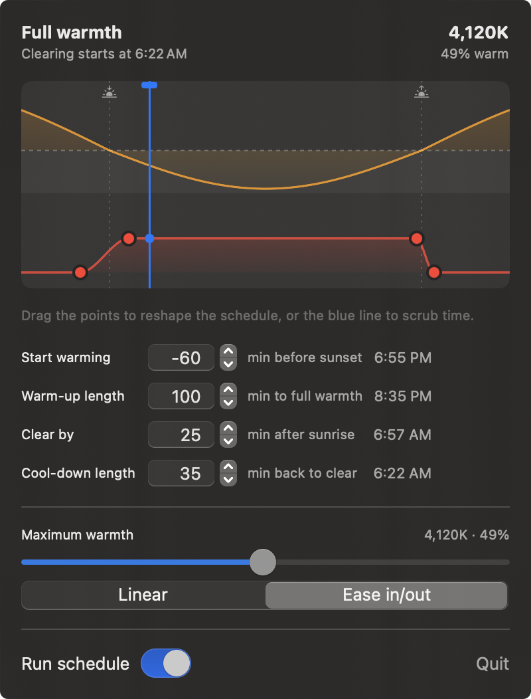

# NightShifter

<p align="center">
  
</p>

A macOS menu bar app that gives Night Shift the schedule macOS won't: warmth that begins at
**sunset minus an offset you choose** and **builds gradually** instead of flipping at a boundary.

macOS only offers "Sunset to Sunrise" or a fixed custom time range, and it gives you a single
warmth level. NightShifter takes the schedule away from the OS and drives warmth itself off the
sun times macOS already computes.

## Running it

```bash
./Scripts/bundle.sh release && open build/NightShifter.app
```

Installing on someone else's Mac? Hand them (or their coding agent) [SETUP.md](SETUP.md) — it walks
the whole thing end to end, including the sun-schedule gotcha that makes a fresh install look broken.

It appears in the menu bar with no Dock icon. It ships **disengaged** — flip "Run schedule" to let
it take over. Quitting hands your original Night Shift mode back.

## How it works

There is no public API for Night Shift. Everything that controls it goes through the private
`CBBlueLightClient` in `CoreBrightness.framework`. We resolve it with `dlopen` + the ObjC runtime,
so a renamed symbol degrades to "unsupported" rather than failing to launch.

- `Sources/NightShifter/CoreBrightness/NightShiftClient.swift` — typed wrapper over the private class
- `Sources/NightShifter/CoreBrightness/SunSchedule.swift` — reads the OS's own sun times
- `Sources/NightShifter/Engine/RampPlan.swift` — offsets → a strength-vs-time function
- `Sources/NightShifter/Engine/RampController.swift` — the 20s tick that applies it
- `Sources/NightShifter/UI/` — the menu bar panel and the sun/warmth curve

### Consequences of using a private API

Not sandboxable, not shippable on the Mac App Store, and it can break on any macOS release. This
is the same trade every app in this space makes (Shifty, MonitorControl, `nightlight`).

## Measured facts (macOS 15.6.1, Apple silicon)

These were measured on the machine, not taken from published headers. They are the reason several
parts of the code look the way they do.

**The strength→Kelvin curve is piecewise linear, with its knee exactly at the values
`getWarningStrength:`/`getWarningCCT:` report.**

```
s ≤ 0.5:  CCT = 6000 − 3800·s        (0.5 → 4100K)
s > 0.5:  CCT = 4100 − 2800·(s−0.5)  (1.0 → 2700K)
```

A single linear fit through the cool half mispredicts the warm end by ~350K.

**CCT is quantised to 20K**, i.e. ~0.0053 strength on the cool segment. That sets the tick rate:
at 20s, the steepest part of a 60-minute ramp moves one quantum roughly every 25 seconds, which is
imperceptible. Ticking faster is wasted work.

**Night Shift is applied below CoreGraphics.** `CGGetDisplayTransferByTable` is byte-identical at
strength 0 and strength 1, so the applied tint cannot be observed — only commanded. The ramp is
therefore open-loop: recompute the target from the clock each tick and set it.

**`getStrength:`/`getCCT:` return the target, not the applied value.** They report a new value
immediately after a set, while the transition is still visibly in progress.

**`getBlueLightStatus:` writes a 40-byte C struct**, but the equivalent Swift struct reports
`MemoryLayout.size == 33` — Swift omits the trailing padding C includes. Passing it via
`withUnsafeMutableBytes` overflows by 7 bytes and silently corrupts the stack. Always hand the
callee an over-allocated raw buffer and read fields back by offset.

**`BrightnessSystemClient.copyPropertyForKey("BlueLightSunSchedule")`** returns sunrise, sunset,
and the previous/next of each. Reading it means never linking CoreLocation and never triggering a
location prompt — and the drawn curve can never disagree with the schedule being applied. Note the
selector is `copyPropertyForKey:`, not `copyProperty:`.

**Mode values**: `0` = off (no schedule), `1` = sunset→sunrise, `2` = custom fixed times.

## Why the curve is normalised rather than true degrees

`BlueLightSunSchedule` gives times, not solar elevation. Recovering latitude from day length is
ill-conditioned — very sensitive to the declination estimate and the refraction constant, and a
plausible-looking fit can land several degrees out. The curve is therefore drawn as a normalised
−1…1 arc whose zero crossings are exactly the OS's sunrise and sunset. If true elevation in degrees
is ever wanted, that means adding CoreLocation and accepting the permission prompt.

## Prior art

- [Shifty](https://github.com/thompsonate/Shifty) (GPLv3) — the reference for `CBBlueLightClient`
  usage; links the private framework via a `.tbd` stub rather than `dlopen`.
- [MonitorControl](https://github.com/MonitorControl/MonitorControl) (MIT) — the menu-bar app shape:
  non-sandboxed, outside the App Store, native OSD, off-the-shelf Sparkle/KeyboardShortcuts/Settings.
